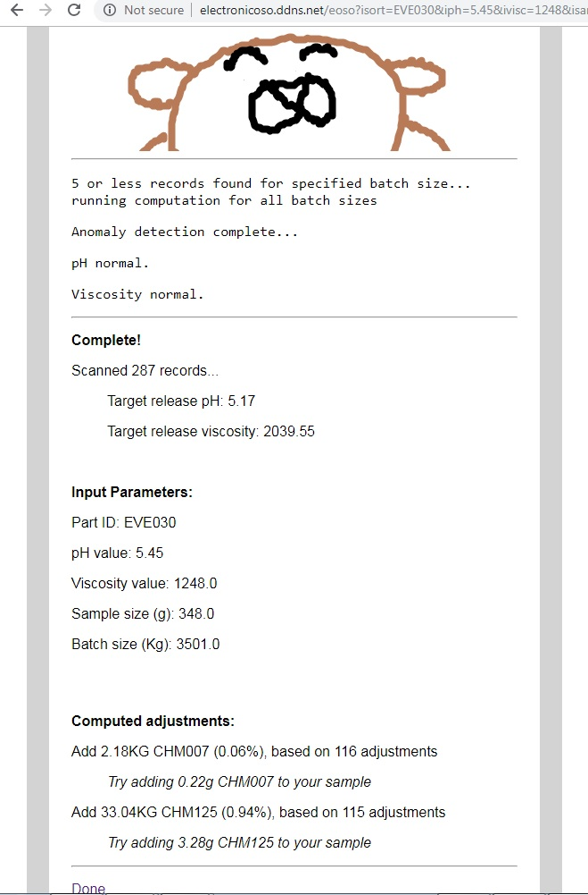

# Electronic Oso

This is a cherrypy webserver which allows a script to query a database and perform data processing on the results based on user input.

To run properly this script requires a database containing proprietary information.

These files are provided for review only.

All original art.

## Screenshots of Usage

### Landing Page

### Report

## Copied from DOCUMENTATION page

### Usage
Complete the form and press submit. Part ID and batch size are required, the other fields may be left blank if they are not relevant. A report will be created preceded by any notes regarding script execution. Record count is updated in realtime and information on advanced options can be viewed in the next section.

Poke the bear to generate a random query.

### Advanced Options
Data Table: selecting this option will append a table showing information about each record scanned.

Anomaly Detection: (usable but work in progress) selecting this option will compare ph and viscosity to the average initial ph and average initial viscosity of the scanned records.

Record Interval: inclusive and specified using batch record numbers, this provides a further data filter.

### How does E-Oso work?
Database records are first filtered by matching the product Part ID and batch size with records that have adjustments. Records with nonstandard adjustments, overadjustments, or two adjustments are ignored. The remaining adjustments are used to calculate the average percent chemical required to increase or decrease a specification by one unit, the specific adjustment percent. The input specifications are then compared against target specifications which are generated by averaging the release specifications of the records. The specific adjustment percent is multiplied by the difference between input and target specifications and then by the batch size to produce a result.

### Advantages and Limitations
This tool provides a rapid assessment for typical batches and is capable of making correct adjustment suggestions for both pH and viscosity. The largest advantage is that the calculation uses data recorded from the end results of production scale tank adjustments. This is important because the accuracy of the adjustment suggestion is driven by the consistency of the data and allows any sources of error characterizing the data to be implicit in the suggestion.

The main limitation is a consequence of the simplicity of the calculation, which models the formula of a line passing through the origin of a graph. The model does not take into account certain nuances such as the adjustment of one specification also impacting the other specification. To improve consistency, and as a result accuracy, the data is filtered to only examine typical batches but in doing so this constrains the suggestion to only be valuable and applicable to a typical batch. The advanced option Anomaly Detector is an early attempt at putting in place a system of comparators for determining batch regularity. Ideally, batch regularity would be represented by a continuous value as an indicator for adjustment suggestion success chance.
